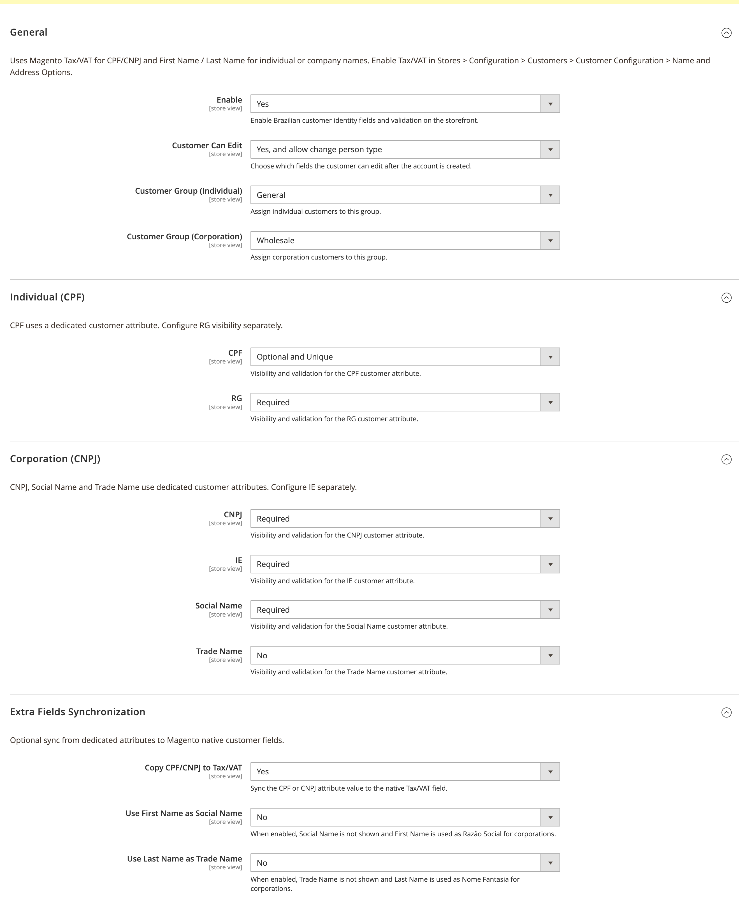
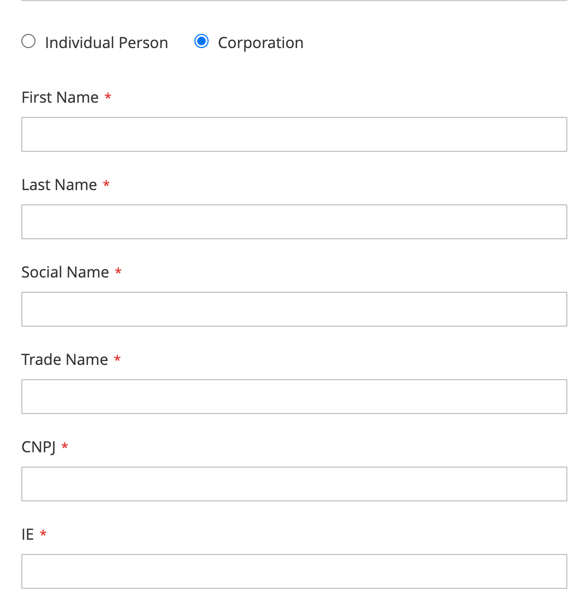

# System Code Brazil Customer Identity Enhanced

## About Module

Extends Brazil Customer Identity with dedicated CPF, CNPJ, Social Name, and Trade Name attributes. Adds configurable visibility, validation, and optional sync to Magento native Tax/VAT and name fields for compatibility with core templates and integrations.

Requires [CustomerIdentityBrazil](https://github.com/m2-systemcode/CustomerIdentityBrazil).

### Configuration

**Stores > Configuration > System Code > Brazil Customer Identity**

Enhanced options appear under **Extra Fields Synchronization**, **Individual (CPF)**, and **Corporation (CNPJ)**.

### Screenshots

#### Admin Configuration


#### Frontend


### Requirements

- `systemcode/customer-identity-brazil`

### How to install

#### ✓ Install by Composer (recommended)
```
composer require systemcode/customer-identity-brazil systemcode/customer-identity-brazil-enhanced
php bin/magento module:enable SystemCode_CustomerIdentityBrazilEnhanced
php bin/magento setup:upgrade
```

#### ✓ Install Manually
- Copy module to folder `app/code/SystemCode/CustomerIdentityBrazilEnhanced` and run commands:
```
php bin/magento module:enable SystemCode_CustomerIdentityBrazilEnhanced
php bin/magento setup:di:compile
php bin/magento setup:upgrade
```

### License
OSL-3.0

### Authors
* [Eduardo Diogo Dias](https://github.com/eduardoddias)


---


## Sobre o Módulo

Estende a Identidade do Cliente (Brasil) com atributos dedicados de CPF, CNPJ, Razão Social e Nome Fantasia. Adiciona visibilidade configurável, validação e sincronização opcional com os campos nativos Tax/VAT e nome do Magento para compatibilidade com modelos e integrações do core.

Requer o [CustomerIdentityBrazil](https://github.com/m2-systemcode/CustomerIdentityBrazil).

### Configuração

**Lojas > Configuração > System Code > Brazil Customer Identity**

As opções Enhanced aparecem em **Sincronização de Campos Adicionais**, **Pessoa Física (CPF)** e **Pessoa Jurídica (CNPJ)**.

### Screenshots

#### Configuração no Admin


#### Frontend


### Requisitos

- `systemcode/customer-identity-brazil`

### Como Instalar

#### ✓ Instalação via Composer (recomendado)
```
composer require systemcode/customer-identity-brazil systemcode/customer-identity-brazil-enhanced
php bin/magento module:enable SystemCode_CustomerIdentityBrazilEnhanced
php bin/magento setup:upgrade
```

#### ✓ Instalação Manual
- Copie o módulo para `app/code/SystemCode/CustomerIdentityBrazilEnhanced` e execute:
```
php bin/magento module:enable SystemCode_CustomerIdentityBrazilEnhanced
php bin/magento setup:di:compile
php bin/magento setup:upgrade
```

### Licença
OSL-3.0

### Autores
* [Eduardo Diogo Dias](https://github.com/eduardoddias)
